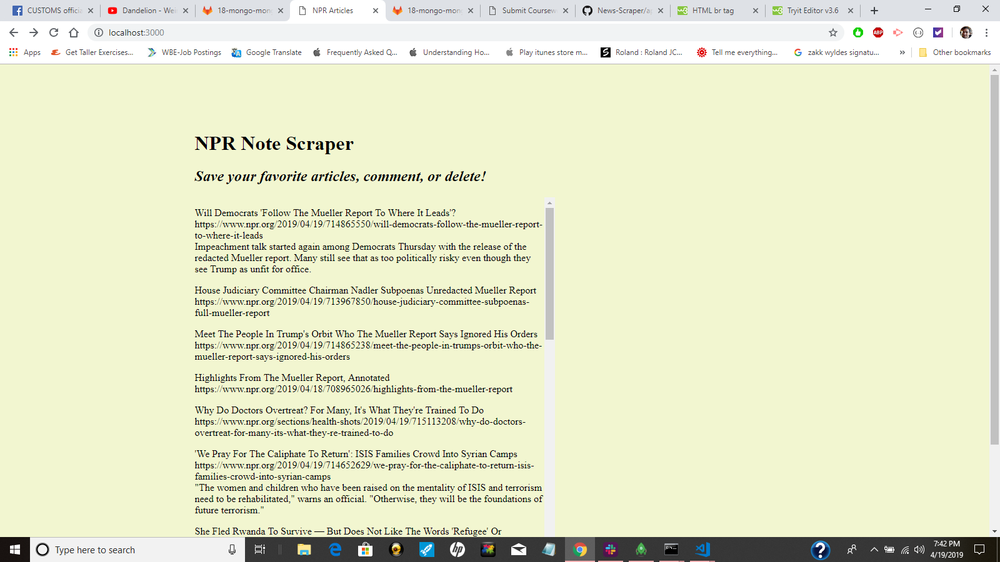
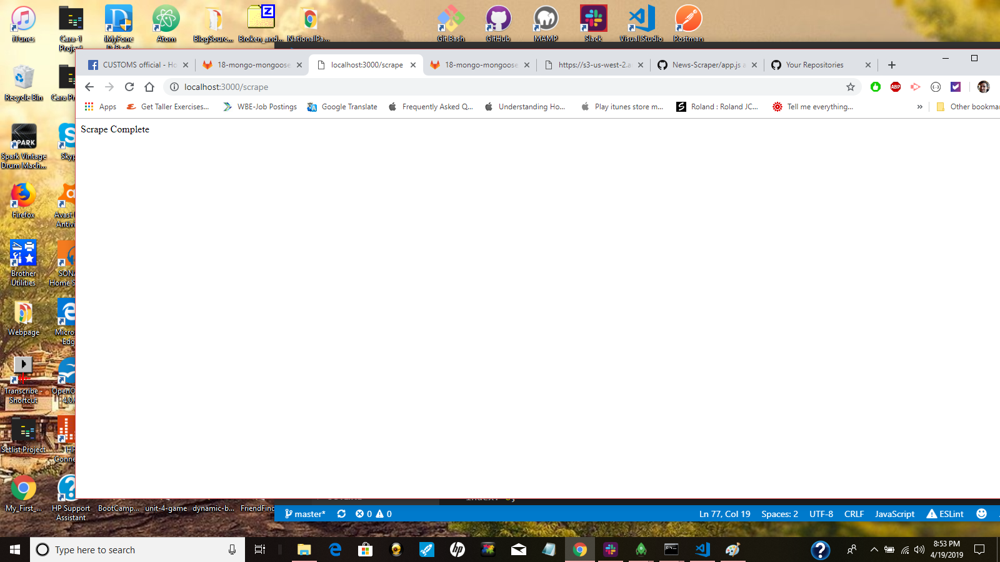
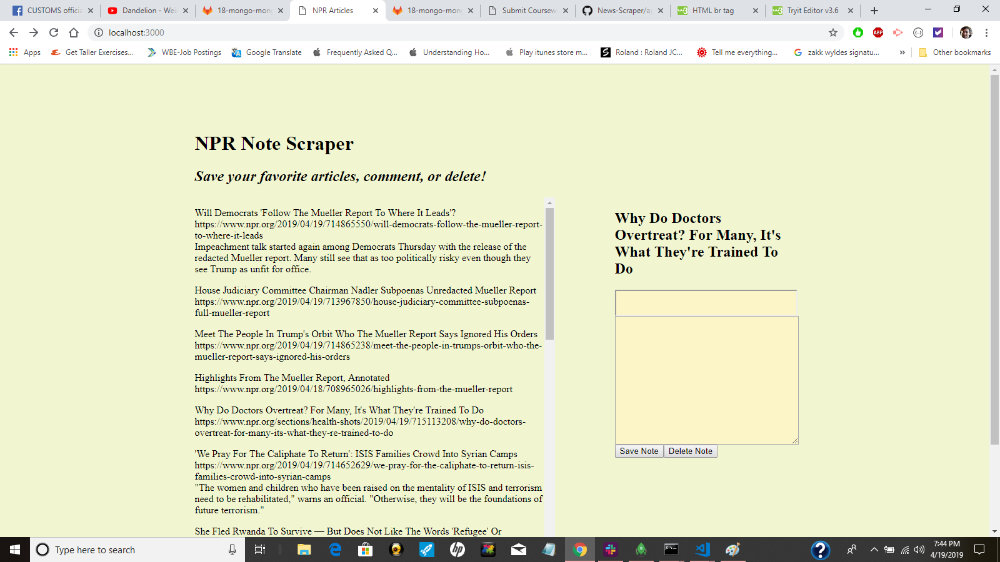
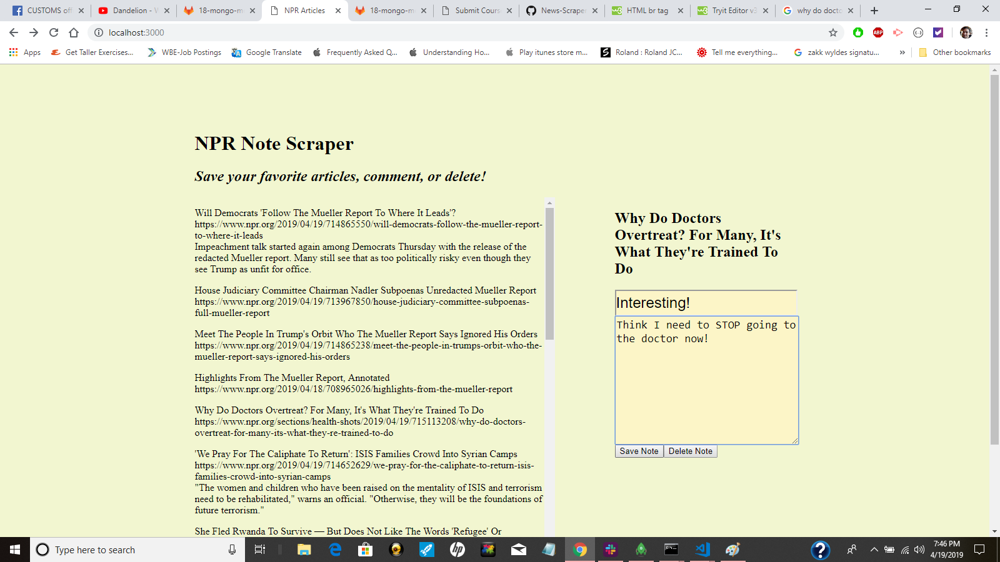
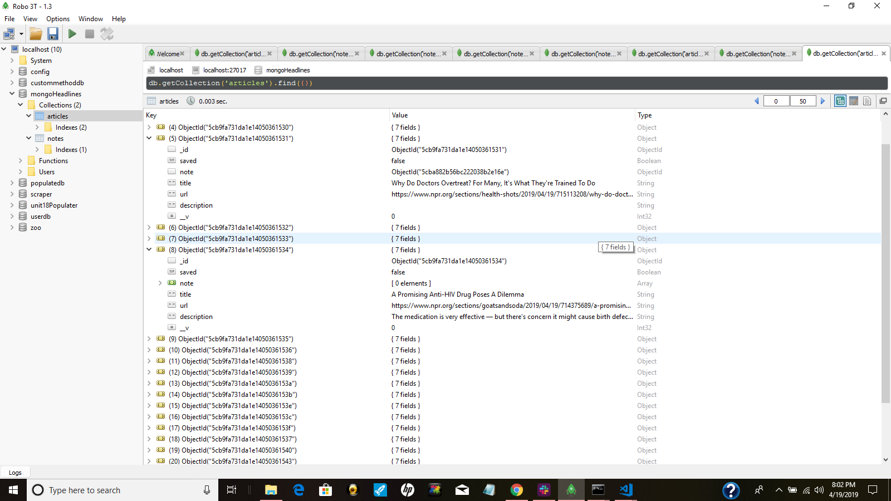
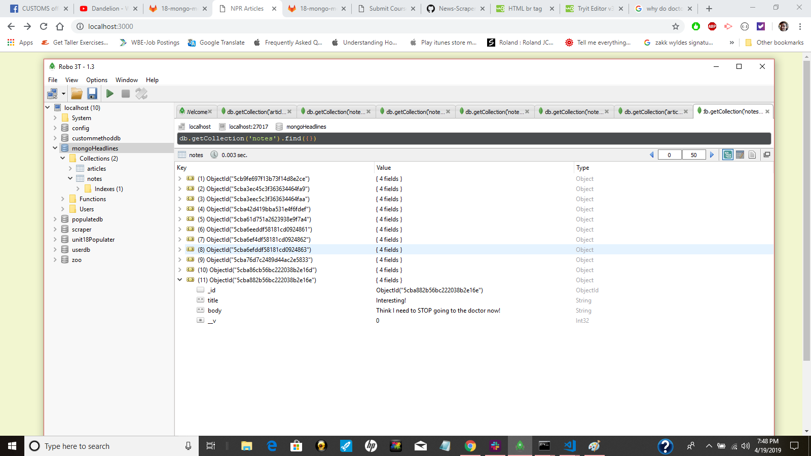
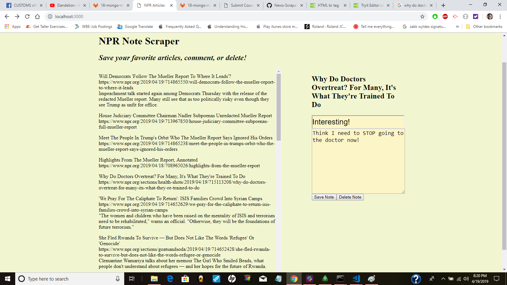

# News Scraper

 I've created a web app that lets users view and leave comments on the latest news. I used AXIOS, Mongoose, and Cheerio to scrape news from the NPR site.  I've stored all my information inside my Mongo database using ROBO 3T.  This is a fullstack web application.

 The information I grabbed from NPR's site: 

  * Headline - the title of the article

  * Summary - a short summary of the article

  * URL - the url to the original article

**Example 1** 

This is the landing page that shows all the articles with a header, link and descriptions. Because of the way NPR's displays its information, not evey article has a description.

**Example 2** 

If I click "scrape new articles", I get the newest articles and a "scarpe" is complete.

**Example 3** 

By clicking on any article I can see the heading on the right side of the page and add a comment in the field.

**Example 4** 

Here I've added some comments and I will click "save."

**Example 5** 

If I go to my database I can see all the information that I scraped.  Here is the same information that displays on the front-end of my app for the article "Why Do Doctors OverTreat? For Many, It's What They're Trained To Do."  You can see the link and heading.  

In the other article, "A Promising Anti-HIV Drug Poses A Dilemma", I have a link, heading, and description. 

**Example 6**

Here is my other table with all the comments that I added.

**Example 7**

If I come back to my NPR front end page and reload the page, I still have my comments!

Deployed at https://scrape-npr-news.herokuapp.com/